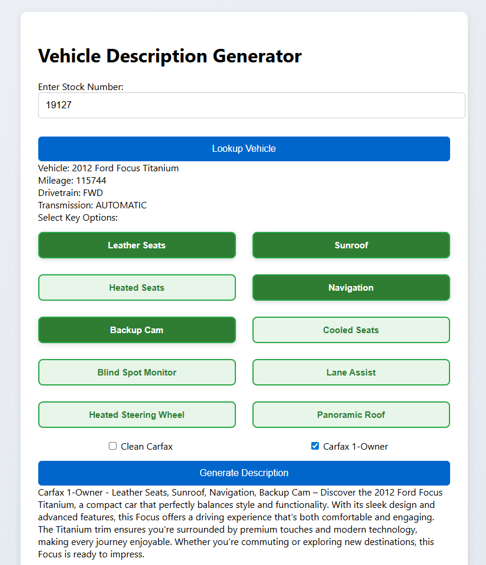

# Vehicle Description Generator

An AI-powered web application that generates professional vehicle descriptions for automotive inventory management. The application reads vehicle data from S3 CSV feeds and uses OpenAI's GPT-4o to create compelling, standardized descriptions for use in inventory management platforms.



## 🚗 Features

- **Stock Number Lookup**: Enter a vehicle stock number to retrieve detailed vehicle information
- **Flexible Options Input**: Add custom features and options (leather seats, sunroof, clean Carfax, etc.)
- **AI-Generated Descriptions**: Professional, engaging 3-4 sentence vehicle descriptions using OpenAI GPT-4o
- **Carfax Integration**: Support for Clean Carfax and Carfax 1-Owner labels
- **Copy-Ready Output**: Descriptions ready to paste into inventory management systems
- **Clean, Responsive UI**: User-friendly interface optimized for desktop and mobile
- **Real-time Processing**: Instant vehicle lookup and description generation

## 🏗️ Architecture

The application consists of three main components:

### Frontend (Static Website)
- **Technology**: Vanilla HTML, CSS, JavaScript
- **Hosting**: AWS S3 with CloudFront CDN
- **Features**: Clean, responsive interface with real-time API integration

### Backend (Serverless API)
- **Technology**: AWS Lambda (Python 3.12)
- **API**: AWS API Gateway with CORS support
- **AI Integration**: OpenAI GPT-4o API
- **Data Source**: S3-hosted CSV inventory feeds
- **Security**: AWS Secrets Manager for API key storage

### Infrastructure
- **Deployment**: AWS CloudFormation templates
- **Security**: IAM roles with minimal required permissions, API keys stored in Secrets Manager
- **Monitoring**: CloudWatch logging for debugging and analytics

## 🚀 Getting Started

### Prerequisites

- AWS CLI configured with appropriate permissions
- An S3 bucket containing your vehicle inventory CSV file
- OpenAI API key stored in AWS Secrets Manager
- OpenAI API access

### Required CSV Format

Your inventory CSV should include these columns:
- `stock_number`: Unique vehicle identifier
- `year`: Vehicle year
- `make`: Vehicle manufacturer
- `model`: Vehicle model
- `Trim`: Vehicle trim level (optional)
- `drivetrain`: Drive system (FWD, RWD, AWD, 4WD)
- `mileage.value`: Current mileage
- `transmission`: Transmission type

### Setup

1. **Store OpenAI API Key in Secrets Manager**:
   ```bash
   aws secretsmanager create-secret \
     --name "vehicle-generator/openai-api-key" \
     --secret-string "your-openai-api-key"
   ```

2. **Deploy Backend Infrastructure**:
   ```bash
   aws cloudformation create-stack \
     --stack-name vehicle-description-backend \
     --template-body file://vehicle-description-backend.yaml \
     --parameters ParameterKey=VehicleFeedBucketName,ParameterValue=your-bucket-name \
     --capabilities CAPABILITY_IAM
   ```

3. **Package and Upload Lambda Code**:
   ```bash
   pip install openai -t .
   zip -r lambda.zip . -x "*.yaml" "*.md" "*.html" "*.css" "*.js" "*.png"
   aws s3 cp lambda.zip s3://your-bucket-name/
   ```

4. **Deploy Frontend Infrastructure**:
   ```bash
   aws cloudformation create-stack \
     --stack-name vehicle-description-frontend \
     --template-body file://vehicle-description-frontend.yaml \
     --parameters ParameterKey=FrontendBucketName,ParameterValue=your-frontend-bucket
   ```

5. **Upload Frontend Files**:
   ```bash
   aws s3 sync . s3://your-frontend-bucket --exclude "*.yaml" --exclude "*.py" --exclude "*.zip"
   ```

6. **Update API Endpoint**: Edit your frontend HTML to use the API Gateway URL from the CloudFormation output.

## 🔧 Configuration

### Environment Variables (Lambda)
- `BUCKET_NAME`: S3 bucket containing inventory CSV
- `CSV_KEY`: Path to CSV file in S3 bucket (e.g., "MP8035.csv")
- `OPENAI_SECRET_NAME`: AWS Secrets Manager secret name (defaults to "vehicle-generator/openai-api-key")

### OpenAI Configuration
- **Model**: GPT-4o for high-quality, engaging descriptions
- **Temperature**: 0.3 for consistent, professional output
- **Max Tokens**: 300 for concise descriptions

### CSV Processing Features
- **Carfax Integration**: Supports "Clean Carfax" and "Carfax 1-Owner" prefixes
- **Smart Drivetrain**: Only mentions AWD/4WD drivetrains in descriptions
- **Flexible Trim Handling**: Gracefully handles missing trim information

## 🎯 Usage

1. **Enter Stock Number**: Input the vehicle's stock number in the search field
2. **Lookup Vehicle**: Click "Lookup Vehicle" to retrieve vehicle details from inventory
3. **Add Options**: Enter key features and options (comma-separated)
4. **Select Carfax Options**: Check appropriate boxes for Clean Carfax or Carfax 1-Owner
5. **Generate Description**: Click "Generate Description" to create AI-powered copy
6. **Copy & Use**: Copy the generated description for use in your inventory platform

### Example Options Input
```
leather seats, sunroof, heated seats, backup camera
```

### Example Generated Output
```
Clean Carfax - Leather Seats, Sunroof, Heated Seats, Backup Camera – This 2020 Honda Accord EX delivers exceptional reliability and comfort with its refined interior and advanced features. The spacious cabin and smooth ride quality make it perfect for both daily commuting and longer journeys. With Honda's reputation for durability and excellent resale value, this Accord represents an outstanding choice in the midsize sedan segment.

At Wallingford Auto Park, we've proudly served the community for over 30 years, offering quality used vehicles with transparent, no-haggle pricing. Our knowledgeable staff and no-pressure approach have helped thousands of customers drive away with confidence.

Posted internet prices include Dealer Financing Savings of $750. Savings not available for cash or outside finance transactions. Must finance with dealer to qualify for all discounts and incentives included in online pricing. Pricing applies to in-stock vehicles only and must take delivery the same day.
```

## 🛠️ Development

### Local Testing
The Lambda function can be tested locally with sample events:

```python
# Test lookup endpoint
event = {
    "path": "/lookup",
    "queryStringParameters": {"stock": "19087"}
}

# Test generate endpoint  
event = {
    "path": "/generate",
    "queryStringParameters": {
        "stock": "19087",
        "options": "leather seats, sunroof",
        "cleanCarfax": "true",
        "carfax1Owner": "false"
    }
}
```

### API Endpoints

- `GET /lookup?stock={stock_number}`: Retrieve vehicle details
- `GET /generate?stock={stock_number}&options={options}&cleanCarfax={boolean}&carfax1Owner={boolean}`: Generate description

## 📊 Monitoring

- **CloudWatch Logs**: Automatic logging for debugging and monitoring
- **API Gateway Metrics**: Built-in request/response monitoring
- **Lambda Metrics**: Performance and error tracking
- **OpenAI API Usage**: Monitor token consumption and costs

## 🔐 Security

- **CORS Enabled**: Secure cross-origin requests
- **IAM Permissions**: Minimal required permissions for each service
- **Secrets Manager**: OpenAI API key securely stored and retrieved
- **HTTPS Only**: CloudFront enforces secure connections
- **No Hardcoded Secrets**: All sensitive data managed through AWS services

## 🚨 Troubleshooting

### Common Issues

**Vehicle Not Found**: Ensure stock number exists in CSV and matches exactly

**API Error**: Check CloudWatch logs for detailed error messages

**CSV Format Issues**: Verify all required columns are present with correct names

**OpenAI API Issues**: 
- Verify API key is correctly stored in Secrets Manager
- Check OpenAI API usage limits and billing
- Review CloudWatch logs for specific error messages

**Secrets Manager Access**: Ensure Lambda execution role has proper permissions to access the secret

## 📝 License

This project is for internal use at automotive dealerships for inventory management purposes.

## 🤝 Contributing

For feature requests or bug reports, please contact the development team.

---

**Note**: This application is designed for automotive inventory management and generates descriptions for legitimate business use in vehicle listings and sales platforms.
